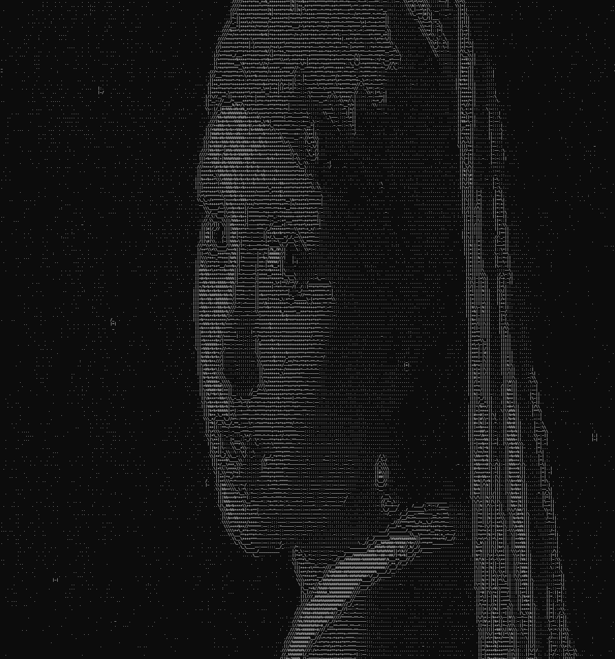
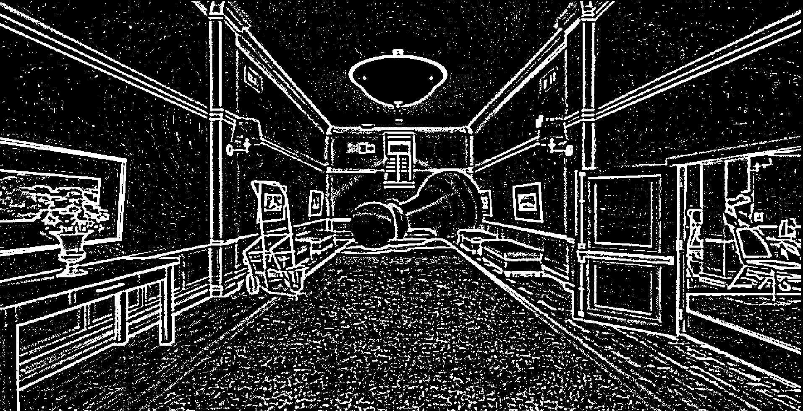
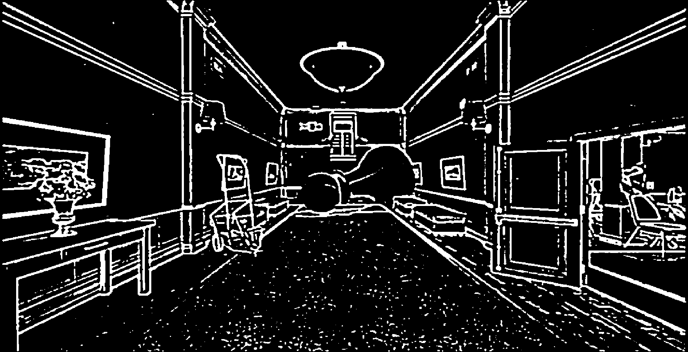
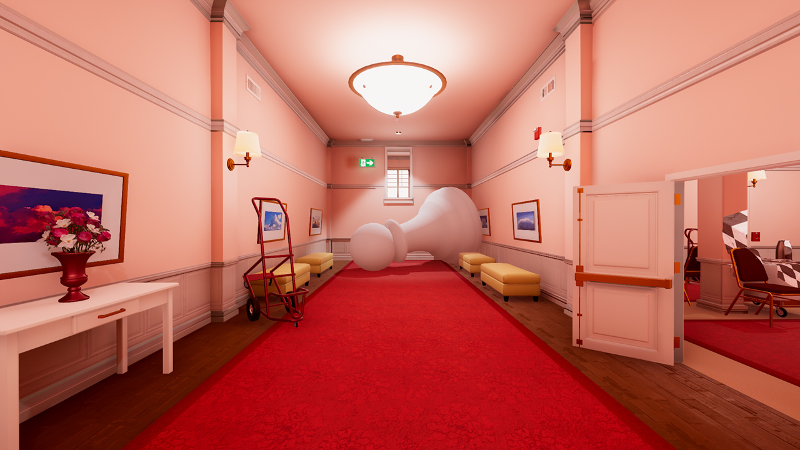

This is a preliminary approach to changing an image to ASCII, using the SFML library (SFML is needed in order to compile).




Unfortunately, the code is far from perfect. The quality of the ASCII image depends on both the terminal size and the brightness of the initial reference. The result lacks also precision due to CPU limitations, many iterations are required to reduce the noise generated by the Difference of Gaussian filter and to properly apply the Sobel Operator to it in the final edge detection pass.

## Code Snippet for the main loop on the image
```
    for (int y = 1; y < ySize - 1; y++) {
        for (int x = 1; x < xSize - 1; x++) {
            int oX = (int)(x / iRatio);        // iRatio is used to set the boundaries of the ascii image in the terminal
            int oY = (int)(y /  iRatio);
                       
            int pixel_x = 0, pixel_y = 0;

            // Apllying the sobel operator
            for (int i = -1; i <= 1; i++) {
                for (int j = -1; j <= 1; j++) {
                    Color pixel = resizedImage.getPixel((int)(x + i) / iRatio,(int) (y + j) / iRatio);
                    grayScale = pixel.r * 0.299 + pixel.g * 0.587 + pixel.b * 0.114;
                    pixel_x += xKernel[i + 1][j + 1] * grayScale;
                    pixel_y += yKernel[i + 1][j + 1] * grayScale;
                }
            }

            int magn = ceil(sqrt(pixel_x * pixel_x + pixel_y * pixel_y));
            magn = min(255, max(0, magn));
						
						// Checking if the magnitude is less than an arbitrary threshold
						// if so it prints the ascii char based on the brightness of the pixel
            if (magn < 190) {
                edgedI.setPixel(oX, oY, Color::Black);
                color2 = resizedImage.getPixel(oX, oY);
                grayScale = color2.r * 0.299 + color2.g * 0.587 + color2.b * 0.114;
                int mappedIndex = (grayScale * (nAscii - 1)) / 256.0;
                cout << asciiChars[mappedIndex];
                continue;
            }
            edgedI.setPixel(oX, oY, Color(magn, magn, magn));

            // using the angle from atan2 to decide what characther to use
            float angle = atan2(pixel_x, pixel_y) * 180.0 / M_PI;
            if (angle < 0) angle += 360;

            char asciiChar;
            if ((angle >= 0 && angle < 22.5) || (angle >= 157.5 && angle < 202.5) || (angle >= 337.5 && angle <= 360)) {
                asciiChar = '|';
            }
            else if ((angle >= 67.5 && angle < 112.5) || (angle >= 247.5 && angle < 292.5)) {
                asciiChar = '_';
            }
            else if ((angle >= 22.5 && angle < 67.5) || (angle >= 202.5 && angle < 247.5)) {
                asciiChar = '/';
            }
            else {
                asciiChar = '\\';
            }

            cout << asciiChar;
        }
        cout << endl;
    }

```

## Blurring Function


```
Image GaussianBlur(Image& image, int kernelsize, float sigma) {
    Image blurredImage = image;
    vector<vector<float>> kernel = GenerateGaussianKernel(kernelsize, sigma);

    Vector2u size = image.getSize();
    Image tempImage = image;

    int halfSize = kernelsize / 2;

    for (unsigned int y = halfSize; y < size.y - halfSize; y++) {
        for (unsigned int x = halfSize; x < size.x - halfSize; x++) {
            float r = 0, g = 0, b = 0;
            float weightSum = 0;

            for (int ky = -halfSize; ky <= halfSize; ky++) {
                for (int kx = -halfSize; kx <= halfSize; kx++) {
                    Color pixel = tempImage.getPixel(x + kx, y + ky);
                    float weight = kernel[ky + halfSize][kx + halfSize];

                    r += pixel.r * weight;
                    g += pixel.g * weight;
                    b += pixel.b * weight;
                    weightSum += weight;
                }
            }

            blurredImage.setPixel(x, y, Color(static_cast<Uint8>(r), static_cast<Uint8>(g), static_cast<Uint8>(b)));
        }
    }

    return blurredImage;
}

```
## Difference Of Gaussians

```
Image GaussianFilterDOG(Image& image, int kernelSize, float sigma1, float sigma2, int threshold, bool bw) {
    Image blurred1 = GaussianBlur(image, kernelSize, sigma1);
    Image blurred2 = GaussianBlur(image, kernelSize, sigma2);

    Image result = image;
    Vector2u size = image.getSize();

    for (unsigned int y = 0; y < size.y; y++) {
        for (unsigned int x = 0; x < size.x; x++) {
            Uint8 gray1 = toGrayscale(blurred1.getPixel(x, y));
            Uint8 gray2 = toGrayscale(blurred2.getPixel(x, y));

            int diff = static_cast<int>(gray2) - static_cast<int>(gray1) + 128;

            diff = max(0, min(255, diff));

            if (bw) {
                // permits the white and black coloration
                diff = (diff > threshold) ? 255 : 0;
            }

            result.setPixel(x, y, Color(diff, diff, diff));
        }
    }

    Image filteredResult = result;
    
    // Reduce the noise of the image, too expensive for CPU
    for (int pass = 0; pass < 2; pass++) {
        for (unsigned int y = 2; y < size.y - 2; y++) {
            for (unsigned int x = 2; x < size.x - 2; x++) {
                vector<int> neighborhood;

                for (int j = -2; j <= 2; j++) {
                    for (int i = -2; i <= 2; i++) {
                        neighborhood.push_back(toGrayscale(result.getPixel(x + i, y + j)));
                    }
                }

                sort(neighborhood.begin(), neighborhood.end());
                int medianValue = neighborhood[12];

                filteredResult.setPixel(x, y, Color(medianValue, medianValue, medianValue));
            }
        }
    }
    return filteredResult;
}

```

## Difference of Gaussians before noise reduction


## After noise reduction


### Original Reference

Check Acerola's video to see the project's inspiration: https://youtu.be/gg40RWiaHRY?si=l_HrLKNFI_svW4JE
